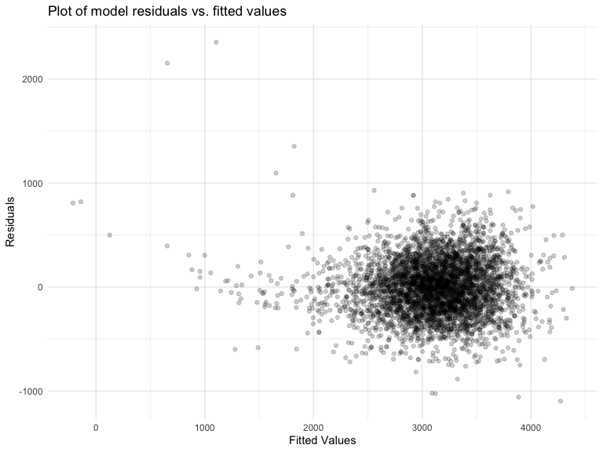

P8105 HW6
================
Wenbo Fei
12/9/2020

# Problem 1

Data importing and cleaning

``` r
homicide_df = 
  read_csv("data/homicide-data.csv", na = c("", "NA", "Unknown")) %>% 
  mutate(
    city_state = str_c(city, state, sep = ", "),
    victim_age = as.numeric(victim_age),
    resolution = case_when(
      disposition == "Closed without arrest" ~ 0,
      disposition == "Open/No arrest"        ~ 0,
      disposition == "Closed by arrest"      ~ 1)
  ) %>% 
  filter(
    victim_race %in% c("White", "Black"),
    city_state != "Tulsa, AL") %>% 
  dplyr::select(city_state, resolution, victim_age, victim_race, victim_sex)
```

For the city of Baltimore, MD

``` r
baltimore_df =
  homicide_df %>% 
  filter(city_state == "Baltimore, MD")

glm(resolution ~ victim_age + victim_race + victim_sex, 
    data = baltimore_df,
    family = binomial()) %>% 
  broom::tidy() %>% 
  mutate(
    OR = exp(estimate),
    CI_lower = exp(estimate - 1.96 * std.error),
    CI_upper = exp(estimate + 1.96 * std.error)
  ) %>% 
  dplyr::select(term, OR, starts_with("CI")) %>% 
  knitr::kable(digits = 3)
```

| term              |    OR | CI\_lower | CI\_upper |
| :---------------- | ----: | --------: | --------: |
| (Intercept)       | 1.363 |     0.975 |     1.907 |
| victim\_age       | 0.993 |     0.987 |     1.000 |
| victim\_raceWhite | 2.320 |     1.648 |     3.268 |
| victim\_sexMale   | 0.426 |     0.325 |     0.558 |

For all cities

``` r
all_df = 
  homicide_df %>% 
  nest(data = -city_state) %>% 
  mutate(
    models = 
      map(.x = data, ~glm(resolution ~ victim_age + victim_race + victim_sex, data = .x, family = binomial())),
    results = map(models, broom::tidy)
  ) %>% 
  dplyr::select(city_state, results) %>% 
  unnest(results) %>% 
  mutate(
    OR = exp(estimate),
    CI_lower = exp(estimate - 1.96 * std.error),
    CI_upper = exp(estimate + 1.96 * std.error)
  ) %>% 
  dplyr::select(city_state, term, OR, starts_with("CI")) 
```

Create a plot to show the estimated ORs and CIs for each city.

``` r
all_df %>% 
  filter(term == "victim_sexMale") %>% 
  mutate(city_state = fct_reorder(city_state, OR)) %>% 
  ggplot(aes(x = city_state, y = OR)) + 
  geom_point() + 
  geom_errorbar(aes(ymin = CI_lower, ymax = CI_upper)) + 
  theme(axis.text.x = element_text(angle = 90, hjust = 1))
```


# Problem 2

``` r
baby_df = 
  read_csv("data/birthweight.csv") %>% 
  janitor::clean_names() %>%
  mutate(
    babysex = factor(babysex), 
    frace = factor(frace), 
    malform = factor(malform), 
    mrace = factor(mrace)
    )
# check for missing data
baby_df %>%  summarise(na_count = sum(is.na(.))) #no missing value
```

    ## # A tibble: 1 x 1
    ##   na_count
    ##      <int>
    ## 1        0

Propose a regression model for birthweight.

Do step-wise model selection based on AIC.

``` r
# step-wise model selection based on AIC
step_model = lm(bwt ~ ., data = baby_df) %>%
  stepAIC(direction = "both", trace = F) %>% 
  broom::tidy()

step_model
```

    ## # A tibble: 14 x 5
    ##    term         estimate std.error statistic   p.value
    ##    <chr>           <dbl>     <dbl>     <dbl>     <dbl>
    ##  1 (Intercept) -6099.      138.       -44.3  0.       
    ##  2 babysex2       28.6       8.45       3.38 7.37e-  4
    ##  3 bhead         131.        3.45      37.9  3.10e-272
    ##  4 blength        74.9       2.02      37.1  4.29e-262
    ##  5 delwt           4.11      0.392     10.5  2.26e- 25
    ##  6 fincome         0.318     0.175      1.82 6.88e-  2
    ##  7 gaweeks        11.6       1.46       7.93 2.79e- 15
    ##  8 mheight         6.59      1.78       3.69 2.23e-  4
    ##  9 mrace2       -139.        9.91     -14.0  1.21e- 43
    ## 10 mrace3        -74.9      42.3       -1.77 7.68e-  2
    ## 11 mrace4       -101.       19.3       -5.21 1.98e-  7
    ## 12 parity         96.3      40.3        2.39 1.70e-  2
    ## 13 ppwt           -2.68      0.427     -6.26 4.20e- 10
    ## 14 smoken         -4.84      0.586     -8.27 1.75e- 16

Based on the result, the proposed model is:
\(bwt = \beta_0 + \beta_1* babysex2 + \beta_2*bhead + \beta_3*blength + \beta_4*delwt + \beta_5*fincome + \beta_6*gaweeks + \beta_7*mheight + \beta_8*mrace2 + \beta_9*mrace3 + \beta_{10}*mrace4 + \beta_{11}*parity + \beta_{12}*ppwt + \beta_{13}*smoken\)

Show a plot of model residuals against fitted values

``` r
#proposed model
baby_fit = lm(bwt ~ babysex + bhead + blength + delwt + fincome + gaweeks + mheight + mrace + parity + ppwt + smoken, data = baby_df)
#plot  
baby_df %>% 
  add_predictions(baby_fit) %>% 
  add_residuals(baby_fit) %>% 
  ggplot(aes(y = resid, x = pred)) + 
  geom_point(alpha = .2) + 
  labs(
    title = "Plot of model residuals vs. fitted values",
    x = "Fitted Values",
    y = "Residuals"
  )
```


